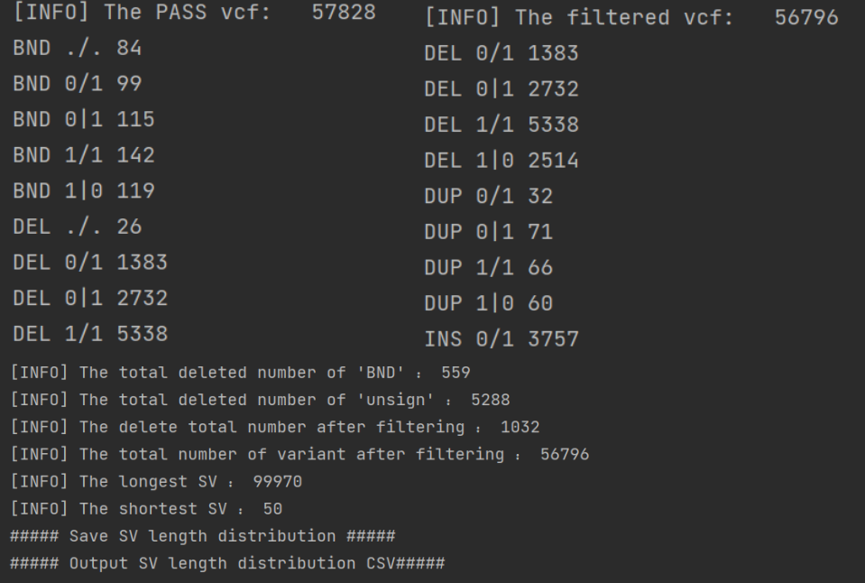
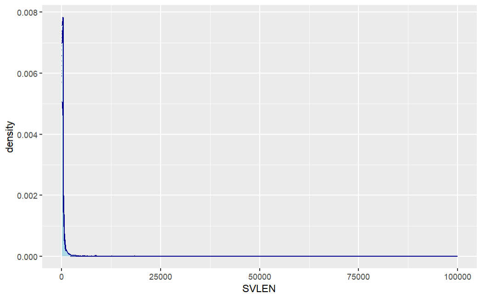

# Processing VCF file Framework of Structural Variant (SV)
 Display Statistical genotypes information and Length distribution of structural variants.<br>

---
Two main steps:<br>
    Display Statistical genotypes information and Length distribution of structural variants.<br>
    (1)Statistical genotypes information fo structural variants from VCF file<br>
    Display SV statistical result in Terminal<br>
    (2)Generate (phased_SV_length_destribution) in CSV<br>

---
## Usage

Run the script like:<br>
```sh
$ python3 SV_stat_vcf.py -v MY_SV.vcf 
```


### Option
You can display Density Plot by R :<br>
```sh
path = "My_len_destribution.csv"
vcf_density = read.csv(path, header=T, sep = '\t',encoding = 'UTF-8')

ggplot(vcf_density, aes(x=SVLEN,group=CHR, fill=label))+
  geom_density(color="darkblue", fill="lightblue")
```

---
### Note
This tool adapts to duel with SV vcf-file generated by structural variants (SVs) software[cuteSV](https://github.com/tjiangHIT/cuteSV),etc..
